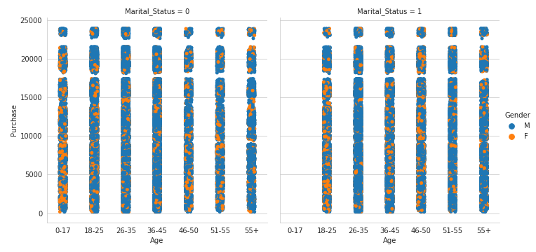

# cebd1120_team_project
CEBD 1260 - Spring 2019 - Team Project

| Name | Date |
|:-------|:---------------|
|Ricardo Rocha| May 11, 2019|
|Frank So| 

## Data Story

"Black Friday is an informal name for the Friday following Thanksgiving Day in the United States, which is celebrated on the fourth Thursday of November. The day after Thanksgiving has been regarded as the beginning of America's Christmas shopping season since 1952, although the term "Black Friday" didn't become widely used until more recent decades."[https://en.wikipedia.org/wiki/Black_Friday_(shopping)](https://en.wikipedia.org/wiki/Black_Friday_(shopping))

A retail store wants to better know customer purchase behavior regarding different products that were sold on previous Black Fridays. They are trying to predict the amount of purchase with the help of information contained in previous transactions in order to offer promotions for a specific part of their clients.

### Set-up & Hook

The distribution of purchase amounts for respective age groups across cities A, B and C for previous years can be seen in Figure 1. In general, men in the 26-35 age group are largest in number. Men in this group are also recorded as greatest in spending amount across all three cities, where the company has stores. Women, on the other hand, peak in number and purchase amount within the 46-50 age group except in City A where the majority of purchases were clearly made by the 0-17 age group.

Figure 1 - The distribution of purchase amounts by age and gender

What if the retailer wants to increase sales for a specific group of customers based on their gender, age or city?

### Rising Insight #1

The store managers could gear their sales efforts on the targeted gender specific age groups on next Black Friday. The type of products to be chosen would depend on the store's past experiences dealing with the respective age group with products that are known to be popular for the targeted gender.

### Rising Insight #2

For the targeted retail store, young single males could be the driving force on Black Friday.

### Aha Moment

On the one hand, the dataset informs, as can be seen in Figure 2, that the majority of Black Friday customers are male, in fact, about 3 times more. On the other hand, including other factors (Marital status and high purchase amount) could be used to test the hypothesis on insight #2.

Figure 2 - The distribution of purchase amounts by age, gender and marital status

### Solution & Next Steps

As we deem profitability in terms of sales/purchase amount, we will focus our analysis around the purchase mean of $ 20,000. This higher amount would typically imply bigger ticket items. Regarding the age group, we will look at the combined age group of 18-35. The blue color (that represents men) appears to dominate this area and this can be confirmed in our later analyses.
